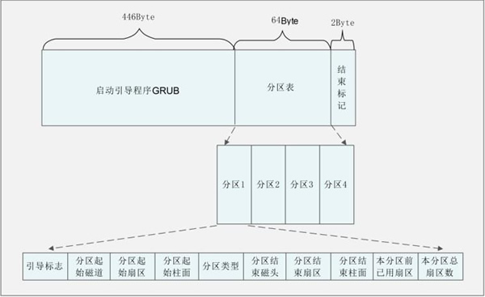
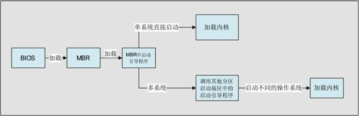

## 主引导区（MBR：Master Boot Record）

## 分区表内容

| 存储字节    | 数据内容及含义                              |
| ----------- | ------------------------------------------- |
| 第1字节     | 引导标志(**0x80：活动** 0x00：非活动) |
| 第2字节     | 本分区的起始磁道号(Header 8位)              |
| 第3字节     | 本分区的起始扇区号(Sector 6位)              |
| 第4字节     | 本分区的起始柱面号(Cylinder 10位)           |
| 第5字节     | 分区类型，可以识别主分区和扩展分区          |
| 第6字节     | 本分区的结束磁道号(Header 8位)              |
| 第7字节     | 本分区的结束扇区号(Sector 6位)              |
| 第8字节     | 本分区的结束柱面号(Cylinder 10位)           |
| 第9~12字节  | 本分区之前已经占用的扇区数(LBA)             |
| 第13~16字节 | 本分区的总扇区数                            |

## 引导程序作用

## grub

- multiboot 多系统启动

## 参考文献

- [主引导目录（MBR）结构及作用详解](https://blog.csdn.net/u010783226/article/details/106069699)
- [主引导记录_百度百科](https://baike.baidu.com/item/%E4%B8%BB%E5%BC%95%E5%AF%BC%E8%AE%B0%E5%BD%95/7612638)
- https://wiki.osdev.org/GRUB
- http://nongnu.askapache.com/grub/phcoder/multiboot.pdf
