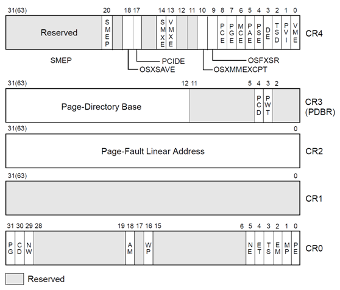

## 汇编各类寄存器

在x86寄存器中，分为（5大类）：通用寄存器、指令指针寄存器、段寄存器、标志寄存器、控制寄存器。

---

通用寄存器（32位）：数据寄存器、指针变址寄存器。

| 数据寄存器     | EAX | EBX | ECX | EDX |
| -------------- | --- | --- | --- | --- |
| 指针变址寄存器 | EBP | ESP | ESI | EDI |

其中数据寄存器可进行拆分位高16位和低16位：

| 寄存器 | 高16位 | 低16位 |
| ------ | ------ | ------ |
| EAX    | 无     | AX     |
| EBX    | 无     | BX     |
| ECX    | 无     | CX     |
| EDX    | 无     | DX     |

低16位又可拆分位高8位和低8位：

| 寄存器 | 高8位 | 第8位 |
| ------ | ----- | ----- |
| AX     | AH    | AL    |
| BX     | BH    | BL    |
| CX     | CH    | CL    |
| DX     | DH    | DL    |

数据寄存器：

| 寄存器             | 解释       | 备注                                                                                                                                            |
| ------------------ | ---------- | ----------------------------------------------------------------------------------------------------------------------------------------------- |
| EAX（Accumulator） | 累计寄存器 | 在乘法和除法指令中被自动使用；在Win32中，一般用在函数的返回值中                                                                                 |
| EBX（Base）        | 基址寄存器 | DS段中的数据指针                                                                                                                                |
| ECX（Count）       | 计数寄存器 | CPU自动使用ECX作为循环计数器，在字符串和循环操作中常用，在循环指令（LOOP）或串操作中，ECX用来进行循环计数，每执行一次循环，ECX都会被CPU自动减一 |
| EDX（Data）        | 数据寄存器 | 无                                                                                                                                              |

指针变址寄存器：

| 寄存器                 | 解释               | 备注                                                                                  |
| ---------------------- | ------------------ | ------------------------------------------------------------------------------------- |
| EBP(Base Pointer)      | 扩展基址指针寄存器 | SS段中堆栈内数据指针。EBP由高级语言用来引用参数和局部变量，通常称为堆栈基址指针寄存器 |
| ESP(Stack Pointer)     | 堆栈指针寄存器     | SS段中堆栈指针。ESP用来寻址堆栈上的数据，ESP寄存器一般不参与算数运算                  |
| ESI(Source Index)      | 源变址寄存器       | 字符串操作源指针                                                                      |
| EDI(Destination Index) | 目的指针寄存器     | 字符串操作目标指针                                                                    |

---

指令指针寄存器：

| 寄存器                   | 解释           | 备注                                                                                                                                                                                                              |
| ------------------------ | -------------- | ----------------------------------------------------------------------------------------------------------------------------------------------------------------------------------------------------------------- |
| EIP(Instruction Pointer) | 指令指针寄存器 | 保存着下一条要执行的指令的地址。程序运行时，CPU会读取EIP中的一条指令的地址，传送指令到指令缓冲区后，EIP寄存器的值自动增加，增加的大小即是读取指令的字节大小，即下一条指令的地址为当前指令的地址加上当前指令的长度 |

---

段寄存器：

| 寄存器            | 解释   | 备注 |
| ----------------- | ------ | ---- |
| CS(Code Segment)  | 代码段 | 无   |
| DS(Data Segment)  | 数据段 | 无   |
| SS(Stack Segment) | 堆栈段 | 无   |
| ES(Extra Segment) | 附加段 | 无   |
| FS                | 附加段 | 无   |
| GS                | 附加段 | 无   |

段寄存器使用约定：

| 序号 | 内存访问类型    | 默认段寄存器 | 可重设的段寄存器 | 段内偏移地址               |
| ---- | --------------- | ------------ | ---------------- | -------------------------- |
| 1    | 取指令          | CS           | 无               | EIP                        |
| 2    | 堆栈操作        | SS           | 无               | ESP                        |
| 3    | 串操作之源串    | DS           | ES、SS           | ESI                        |
| 4    | 串操作之目标串  | ES           | 无               | EDI                        |
| 5    | EBP用作基址寻址 | SS           | ES、DS           | 按寻址方式计算得到有效地址 |
| 6    | 一般数据存取    | ES           | ES、SS           | 按寻址方式计算得到有效地址 |

---

标志寄存器：

| 寄存器                              | 解释       | 备注             |
| ----------------------------------- | ---------- | ---------------- |
| FLAGS 或 PSW（Program State Word） | 标志寄存器 | 程序状态字寄存器 |

标志寄存器各个位示意图：

| 15 | 14 | 13 | 12 | 11 | 10 | 9  | 8  | 7  | 6  | 5 | 4  | 3 | 2  | 1 | 0  |
| -- | -- | -- | -- | -- | -- | -- | -- | -- | -- | - | -- | - | -- | - | -- |
| x  | x  | x  | x  | OF | DF | IF | TF | SF | ZF | x | AF | x | PF | x | CF |

标志寄存器又分为两类：条件标志寄存器、控制标志寄存器。

条件标志寄存器：

| 寄存器                    | 解释           | 备注                                                                                                               |
| ------------------------- | -------------- | ------------------------------------------------------------------------------------------------------------------ |
| OF(OverFlow Flag)         | 溢出标志位     | 用来反应有符号数加减法运算所得结果是否溢出。运算超出当前运算位数所能表示的范围，则称为溢出，标志位被置为1，否则为0 |
| SF(Sign Flag)             | 符号标志位     | 用来反应运算结果是否为0。运算结果为负时置为1，否则为0                                                              |
| ZF(Zero Flag)             | 零标志位       | 用来反应运算结果是否为0。为零时置为1，否则为0                                                                      |
| AF(Auxilliary carry Flag) | 辅助进位标志位 | 在字操作址，发生低字节向高字节进位或借位时该标志位被置为1，否则为0                                                 |
| PF(Parity Flag)           | 奇偶标志位     | 用于反应结果中“1”的个数的奇偶性。如果“1”为偶数置为1，否则为0                                                   |
| CF(Carry Flag)            | 进位标志位     | 运算结果的最高位产生了一个进位或错位，则该标志位置为1，否则为0                                                     |

控制标志寄存器：

| 寄存器             | 解释       | 备注                                                                                                                                             |
| ------------------ | ---------- | ------------------------------------------------------------------------------------------------------------------------------------------------ |
| DF(Direction Flag) | 方向标志位 | 用于串操作指令中，控制地址的变化方向。当DF为0时，存储器地址自动增加;当 DF为1时，存储器地址自动减少                                               |
| IF(Interupt Flag)  | 中断标志位 | 用于控制外部可屏蔽中断是否可以被处理器响应（总开关）                                                                                             |
| TF(Trap Flag)      | 陷阱标志位 | 用于控制处理器是否进入单步操作方式。当TF为0时，处理器在正常模式下运行；当为1时，处理器单步执行指令，调试器可以逐步指令进行执行就是使用了该标志位 |

---

控制寄存器（Control Register）

x86/x86_64 CPU 中提供了控制寄存器，来决定CPU的操作模式和当前执行任务的属性。这些寄存器在32位模式下是32bit，在64位模式中，控制寄存器扩展为64位。

CPU架构中共有CR0、CR1、CR2、CR3、CR4、CR8共6个控制寄存器，如下图。

- CR0：包含当前处理器的控制标志。
- CR1：保留。
- CR2：包含发生页错误时的线性地址。
- CR3：页面目录表（Page Directory Table）的物理地址。
- CR4：包含处理器扩展功能的标志位。
- CR8：提供对任务优先级寄存器（Task Priority Register）的读写（仅在64位模式下存在）。
