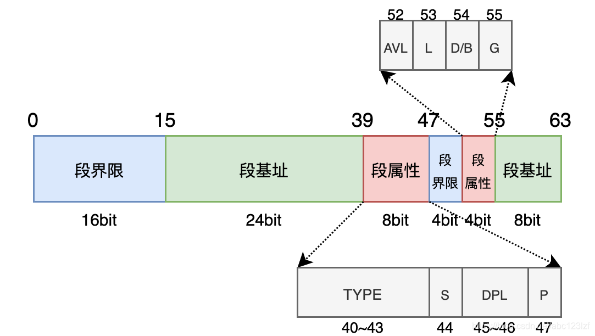
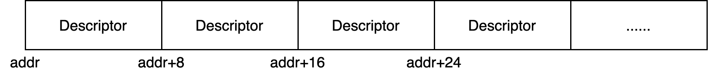
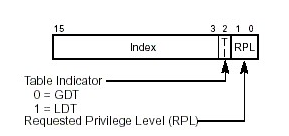

## 80286 CPU(保护模式)

- 1982年, Intel推出80286芯片
- 段寄存器: 16位, 通用寄存器: 16位, 地址总线: 24位(16M 内存空间)
- 工作方式:
  - 实模式: 内存地址 = 段寄存器 << 4 + 通用寄存器(访问 1M 内存空间)
  - 保护模式: 内存地址 = 段基地址 + 段内偏移地址 (访问 16M 内存空间)
- 遗留问题:
  - 通用寄存器依然是16位,无法直接访问全部内存地址


## 80386 CPU(保护模式)

- 1985年10月，Intel公司发布了其第一片32位微处理器80386
- 段寄存器: 16位, 通用寄存器: 32位, 地址总线: 32位(4G 内存空间)
- 工作方式:
  - 实模式: 内存地址 = 段寄存器 << 4 + 通用寄存器(访问 1M 内存空间)
  - 保护模式: 内存地址 = 段基地址 + 段内偏移地址 (访问 4G 内存空间)
- 通用寄存器可直接访问全部内存区域


```nasm
; 描述符
; usage: Descriptor Base, Limit, Attribute
;        Base:      dd
;        Limit:     dd (low 20 bits available)
;        Attribute: dw (lower 4 bits of higher byte are always 0)
%macro Descriptor 3                             ; 段基址， 段界限， 段属性
	dw %2 & 0xffff			        ; 段界限1
	dw %1 & 0xffff                          ; 段基址1
	db (%1 >> 16) & 0xff                    ; 段基址2
	dw ((%2 >> 8) & 0x0f00) | (%3 & 0xf0ff) ; 属性1 + 段界限2 + 属性2
	db (%1 >> 24) & 0xff                    ; 段基址3
%endmacro                                       ; 共8字节
```

## 全局段描述符

一个GDT 段描述符占用8个字节,包含三个部分:

* 段基址(32 位), 占据描述符的第16 ~ 39位和第55 ~ 63位, 前者存储低24位, 后者存储高8位
* 段界限(20 位), 占据描述符的第0 ~ 15位和第48 ~ 51位, 前者存储低16位, 后者存储高4位
* 段属性(12 位), 占据描述符的第39 ~ 47位和第49 ~ 55位, 段属性可以细分为8种：`TYPE`属性、`S`属性、`DPL`属性、`P`属性、`AVL`属性、`L`属性、`D/B`属性和 `G`属性



下面介绍各个属性的作用:

```nasm
; Segment Attribute 段属性
DA_32       equ 0x4000 ; 保护模式下32位段
DA_DR       equ 0x0090 ; 只读数据段
DA_DRW      equ 0x0092 ; 可读写数据段
DA_SRW      equ 0x0096 ; 可读写栈段
DA_DRWA     equ 0x0093 ; 已访问可读写数据段
DA_SRWA     equ 0x0097 ; 已访问可读写栈段
DA_C        equ 0x0098 ; 只执行代码段
DA_CR       equ 0x009a ; 可执行可读代码段
DA_CCO      equ 0x009c ; 只执行一致代码段
DA_CCOR     equ 0x009e ; 可执行可读一致代码段
DA_LIMIT_4K equ 0x8000 ; 单位大小4K

; Segment Pirvilege 段特权级
DA_DPL0 equ 0x00 ; DPL = 0
DA_DPL1 equ 0x20 ; DPL = 1
DA_DPL2 equ 0x40 ; DPL = 2
DA_DPL3 equ 0x60 ; DPL = 3

; Special Attribute
DA_LDT equ 0x82 ; 局部段描述符表 

; Gate Attribute 门描述符属性
DA_TaskGate equ 0x85 ; 任意门类型值
DA_386TSS   equ 0x89 ; 可以用 386 任务状态段类型值
DA_386CGate equ 0x8c ; 386 调用门类型值
DA_386IGate equ 0x8e ; 386 中断门类型值
DA_386TGate equ 0x8f ; 386 陷进门类型值
```

### **S属性**

S属性存储了描述符的类型

- S = 0 时, 该描述符对应的段是系统段(System Segment)
- S = 1 时, 该描述符对应的段是数据段(Data Segment)或者代码段(Code Segment)

### **TYPE 属性**

TYPE 属性存储段的类型信息, 该属性的意义随着S属性的不同而不同

当 S = 1 (该段为数据段或代码段)时, 需要分为两种情况:

- 当TYPE属性第三位为0时, 代表该段为数据段, 第0 ~ 2位的作用为:

  | 位  | 作用         | 值为0时        | 值为1时            |
  | --- | ------------ | -------------- | ------------------ |
  | 2   | 段的增长方向 | 向上增长       | 向下增长(例如栈段) |
  | 1   | 段的写权限   | 只读           | 可读可写           |
  | 0   | 段的访问标记 | 该段未被访问过 | 该段已被访问过     |

  (第0位对应描述符的第43位, 第1位对应第42位, 以此类推)
- 当TYPE属性第三位为1时, 代表该段为代码段, 第0 ~ 2位的作用为:

  | 位  | 作用           | 值为0时        | 值为1时        |
  | --- | -------------- | -------------- | -------------- |
  | 2   | 一致代码段标记 | 不是一致代码段 | 是一致代码段   |
  | 1   | 段的读权限     | 只能执行       | 可读 可执行    |
  | 0   | 段的访问标记   | 该段未被访问过 | 该段已被访问过 |

  一致代码段的“一致”意思是：当CPU执行 `jmp`等指令将CS寄存器指向该代码段时:


  - 如果当前的特权级低于该代码段的特权级，那么当前的特权级会被延续下去（简单的说就是可以被低特权级的用户直接访问的代码），如果当前的特权级高于该代码段的特权级，那么会触发常规保护错误（可以理解为内核态下不允许直接执行用户态的代码）
  - 如果不是一致代码段并且该代码段的特权级不等于（高于和低于都不行）当前的特权级，那么会引发常规保护错误。

当 S = 0 (该段为系统段)时:

| TYPE的值(16进制) | TYPE的值(2进制) | 解释                          |
| ---------------- | --------------- | ----------------------------- |
| 0x1              | 0 0 0 1         | 可用286TSS                    |
| 0x2              | 0 0 1 0         | 该段存储了局部描述符表（LDT） |
| 0x3              | 0 0 1 1         | 忙的286TSS                    |
| 0x4              | 0 1 0 0         | 286调用门                     |
| 0x5              | 0 1 0 1         | 任务门                        |
| 0x6              | 0 1 1 0         | 286中断门                     |
| 0x7              | 0 1 1 1         | 286陷阱门                     |
| 0x9              | 1 0 0 1         | 可用386TSS                    |
| 0xB              | 1 0 1 1         | 忙的386TSS                    |
| 0xC              | 1 1 0 0         | 386调用门                     |
| 0xE              | 1 1 1 0         | 386中断门                     |
| 0xF              | 1 1 1 1         | 386陷阱门                     |

(其余值均为未定义)

### **DPL属性**

DPL属性占2个比特，记录了访问段所需要的特权级，特权级范围为0～3，越小特权级越高

### **P属性**

P属性标记了该段是否存在：

- P = 0 时，该段在内存中不存在
- P = 1 时，该段在内存中存在

尝试访问一个在内存中不存在的段会触发段不存在错误（#NP）

### **AVL属性**

AVL属性占1个比特，该属性的意义可由操作系统、应用程序自行定义。
Intel保证该位不会被占用作为其他用途。

### **L属性**

该属性仅在IA-32e模式下有意义，它标记了该段是否为64位代码段。
当L = 1 时，表示该段是64位代码段。
如果设置了L属性为1，则必须保证D属性为0。

### **D/B属性**

D/B属性中的D/B全称 Default operation size / Default stack pointer size / Upper bound。
该属性的意义随着段描述符是代码段（Code Segment）、向下扩展数据段（Expand-down Data Segment）还是栈段（Stack Segment）而有所不同。

- 代码段（S属性为1，TYPE属性第三位为1）
  如果对应的是代码段，那么该位称之为D属性（D flag）。如果设置了该属性，那么会被视为32位代码段执行；如果没有设置，那么会被视为16位代码段执行。
- 栈段（被SS寄存器指向的数据段）
  该情况下称之为B属性。如果设置了该属性，那么在执行堆栈访问指令（例如PUSH、POP指令）时采用32位堆栈指针寄存器（ESP寄存器），如果没有设置，那么采用16位堆栈指针寄存器（SP寄存器）。
- 向下扩展的数据段
  该情况下称之为B属性。如果设置了该属性，段的上界为4GB，否则为64KB。

### **G属性**

G属性记录了段界限的粒度：

- G = 0 时，段界限的粒度为字节
- G = 1 时，段界限的粒度为4KB

例如，当G = 0 时, 并且描述符中的段界限值为10000，那么该段的界限为10000字节，如果G = 1，那么该段的界限值为40000KB

所以说，当G = 0 时，一个段的最大界限值为1MB（因为段界限只能用20位表示），最小为1字节（段的大小等于段界限值加1）。当G = 1 时，最大界限值为4GB，最小为4KB

在访问段（除栈段）时，如果超出了段的界限，那么会触发常规保护错误（#GP）, 如果访问栈段超出了界限，那么会产生堆栈错误（#SS）

## 全局段描述符表(GDT)

由相同段描述符组成的数据表,它们连续进行排放,类似于C 语言的数组



```nasm
[section .gdt]
; GDT definition
;                                           段基址         段界限               段属性
GDT_ENTRY           :      Descriptor         0,            0,                  0
FLAT_MODE_CODE_DESC :      Descriptor         0,         0xfffff,          DA_32 + DA_C + DA_LIMIT_4K + DA_DPL0
VIDEO32_DESC        :      Descriptor     0xB8000,       0x07FFF,          DA_32 + DA_DRWA + DA_DPL0
KERNEL_DATA_DESC    :      Descriptor         0,     KernelDataLen - 1,    DA_32 + DA_DRWA + DA_DPL0
KERNEL_STACK_DESC   :      Descriptor         0,            0,             DA_32 + DA_SRWA + DA_DPL0
FLAT_MODE_DATA_DESC :      Descriptor         0,         0xfffff,          DA_32 + DA_DRWA + DA_LIMIT_4K + DA_DPL0
CODE32_DESC         :      Descriptor         0,   Code32SegmentLen - 1,   DA_32 + DA_C + DA_DPL0
LDT_DESC            :      Descriptor         0,            0,             0
TSS_DESC            :      Descriptor         0,            0,             0
; end of global descriptor table

GdtLen         equ          $ - GDT_ENTRY
; end of [section .gdt]
```

## GDTR寄存器

用于存储全局段描述符表的信息:


```nasm
; GDT pointer
GdtPtr:
	dw          GdtLen - 1 ; GDT 界限
	dd          0          ; GDT 基地址

; lgdt [GdtPtr]; 加载 gdt
; sgdt [GdtPtr]; 保存 gdt
```

## GDT选择子(GDT Selector)

在保护模式下,段寄存器保存的是16位选择子的值,由于描述符大小为8字节且紧密排列,所以选择子低3位用作其他地方



```
; Selector Attribute 选择子属性
; Selector Privilege 选择子特权级
SA_RPL0 equ 0 ; RPL = 0
SA_RPL1 equ 1 ; RPL = 1
SA_RPL2 equ 2 ; RPL = 2
SA_RPL3 equ 3 ; RPL = 3

SA_TIG equ 0 ; GDT 全局段描述符表
SA_TIL equ 4 ; LDT 局部段描述符表

; GDT Selector
UndefinedSelector      equ (0x0000 << 3) + SA_TIG + SA_RPL0
FlatModeCodeSelector   equ (0x0001 << 3) + SA_TIG + SA_RPL0
Video32Selector        equ (0x0002 << 3) + SA_TIG + SA_RPL0
KernelDataSelector     equ (0x0003 << 3) + SA_TIG + SA_RPL0
KernelStackSelector    equ (0x0004 << 3) + SA_TIG + SA_RPL0
FlatModeDataSelector   equ (0x0005 << 3) + SA_TIG + SA_RPL0
Code32Selector         equ (0x0006 << 3) + SA_TIG + SA_RPL0
LdtSelector            equ (0x0007 << 3) + SA_TIG + SA_RPL0
TssSelector            equ (0x0008 << 3) + SA_TIG + SA_RPL0
```

## 如何进入保护模式

1. 加载全局段描述符表.(这里也顺便加载中断描述符表)

```nasm
; 1. load GDT and load IDT
lgdt [GdtPtr]
lidt [IdtPtr]
```

2. 关闭中断.

```nasm
; 2. close interrupt
cli
```

3. 打开A20地址线.

```nasm
; 3. open A20
in al, 0x92
or al, 0000_0010b
out 0x92, al
```

4. 设置CR0控制寄存器,进入保护模式.

```nasm
; 4. enter protect mode
mov eax, cr0
or eax, 0x01
mov cr0, eax
```

5. 刷新流水线,跳转到32位代码段.

```nasm
; 5. jump to 32 bits code
jmp dword Code32Selector : 0
```

## 参考文献

- [Global Descriptor Table](https://wiki.osdev.org/GDT)
