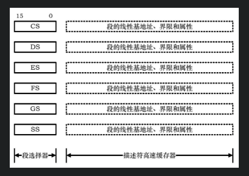

## 简介

* 虚拟8086模式是指利用一种硬件虚拟化技术,在i386的芯片上模拟出多个8086芯片.当处理器进入保护模式后,基于实模式的应用就不能直接运行了,采用虚拟8086模式,则可以让这些实模式的应用运行在基于保护模式的操作系统上,因此这种模式也被称为Virtual Real mode.

## 如何跳转

* 这里讲述的是在成功进入保护模式之后,如何才能跳转会实模式.
* 在讲解如何跳转回实模式之前,我们先来讲讲段寄存器高速缓存.

### 描述符高速缓存器



- 在保护模式以及实模式中,段寄存器分为可见部分以及不可见部分.
- 可见部分是我们设置段寄存器的值,这不是我们的重点.
- 不可见部分在我们设置段寄存器值的时候,硬件帮我们做的,我们无法通过命令来设置.
- 在设置段寄存器的时候,计算出段基址,段界限以及段属性并将值写入缓存,从而避免每次计算.
- 在实模式下,段高速缓存器依然在工作,所以从保护模式跳转回实模式最主要的是将段高速缓存设置原来正确的值.

### 实模式下段高速缓存器的值

| 段选择器 | 基地址 | 界限   | 属性   |
| -------- | ------ | ------ | ------ |
| CS       | 0      | 0xFFFF | DA_C   |
| DS       | 0      | 0xFFFF | DA_DRW |
| ES       | 0      | 0xFFFF | DA_DRW |
| FS       | 0      | 0xFFFF | DA_DRW |
| GS       | 0      | 0xFFFF | DA_DRW |
| SS       | 0      | 0xFFFF | DA_DRW |

```nasm
[section .gdt]
; GDT definition
;                                           段基址         段界限             段属性
GDT_ENTRY       :     Descriptor              0,            0,                0
CODE32_DESC     :     Descriptor              0,    Code32SegLen - 1,    DA_C + DA_32
VIDEO_DESC      :     Descriptor           0xB8000,       0x07FFF,       DA_DRWA + DA_32
DATA32_DESC     :     Descriptor              0,    Data32SegLen - 1,    DA_DR + DA_32
STACK32_DESC    :     Descriptor              0,     TopOfStack32,       DA_DRW + DA_32
CODE16_DESC     :     Descriptor              0,        0xFFFF,          DA_C 
UPDATE_DESC     :     Descriptor              0,        0xFFFF,          DA_DRW
TASK_A_LDT_DESC :     Descriptor              0,     TaskALdtLen - 1,    DA_LDT
; GDT end

GdtLen    equ   $ - GDT_ENTRY

Code32Selector    equ (0x0001 << 3) + SA_TIG + SA_RPL0
VideoSelector     equ (0x0002 << 3) + SA_TIG + SA_RPL0
Data32Selector    equ (0x0003 << 3) + SA_TIG + SA_RPL0
Stack32Selector   equ (0x0004 << 3) + SA_TIG + SA_RPL0
Code16Selector    equ (0x0005 << 3) + SA_TIG + SA_RPL0
UpdateSelector    equ (0x0006 << 3) + SA_TIG + SA_RPL0
TaskALdtSelector  equ (0x0007 << 3) + SA_TIG + SA_RPL0
; end of [section .gdt]

BACK_ENTRY_SEGMENT:
    ; 重新刷新段寄存器可见部分
    mov ax, cs
    mov ds, ax
    mov es, ax
    mov ss, ax
    mov sp, TopOfStack16
  
    ; 关闭A20地址线, 范围1M内存地址空间
    in al, 0x92
    and al, 1111_1101b
    out 0x92, al
  
    ; 打开中断
    sti
  
    ; 利用中断打印信息
    mov bp, HELLO_WORLD
    mov cx, 12
    mov dx, 0
    mov ax, 0x1301
    mov bx, 0x0007
    int 0x10
  
    jmp $

[section .s16]
[bits 16]
CODE16_SEGMENT:
    ; 刷新剩下段寄存器的高速缓存
    mov ax, UpdateSelector
    mov ds, ax
    mov es, ax
    mov fs, ax
    mov gs, ax
    mov ss, ax
  
    ; 关闭CR0 PE位 退出保护模式
    mov eax, cr0
    and al, 1111_1110b
    mov cr0, eax

BACK_TO_REAL_MODE:  
    jmp 0 : BACK_ENTRY_SEGMENT
  
Code16SegLen    equ    $ - CODE16_SEGMENT

  
[section .s32]
[bits 32]
CODE32_SEGMENT:
    mov ax, VideoSelector
    mov gs, ax
  
    mov ax, Stack32Selector
    mov ss, ax
  
    mov eax, TopOfStack32
    mov esp, eax
  
    mov ax, Data32Selector
    mov ds, ax
    mov es, ax
    mov fs, ax
    mov gs, ax
  
    ; 这里跳转就刷新了CS的高速缓存.
    jmp Code16Selector : 0
```

## 结论

    所以要从保护模式跳转回实模式,需要通过合适的选择子来刷新段寄存器高速缓存,从而在跳转后能够正常的访问内存数据,这其中就要先跳转回基地址为0,界限为0xFFFF,16位可执行代码段中(用于刷新CS的段高速缓存),然后在这代码段中在对其他段寄存器进行设置(基地址为0,界限为0xFFFF,16位可读写数据段).进而才能成功跳转回实模式.
